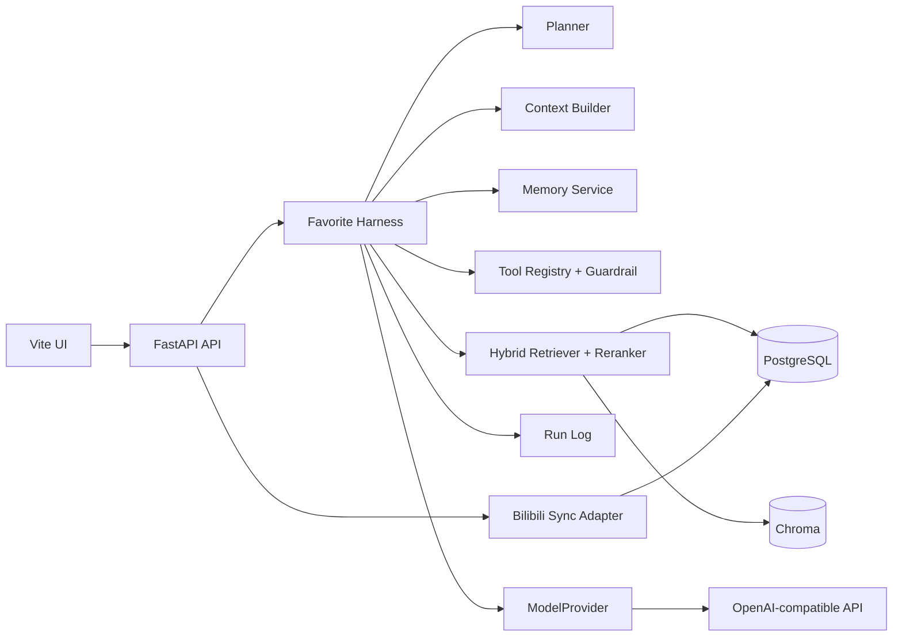

# Architecture

## Data ownership

PostgreSQL stores users, favorite snapshots, sync jobs, topic analyses, cleanup scans, sessions, runs, memories, feedback, learning projects and proactive suggestions. Every business query is scoped by `uid`.

Chroma stores only rebuildable retrieval vectors. Collection metadata records the Embedding Provider, model, suffix and schema version. Switching Embedding configuration creates a separate collection; rebuilding the index is safe.

## Harness flow

1. Create or restore an Agent Session.
2. Planner selects a registered Skill; deterministic routing is the fallback.
3. Context Builder injects eight recent messages, one summary and at most eight relevant memories.
4. Retriever merges Chroma semantic recall with PostgreSQL snapshot matching.
5. Reranker applies 55% semantic relevance, 20% current goal, 15% active profile, and 10% feedback/freshness.
6. Guardrail blocks `mutate` Skills without explicit confirmation.
7. The response, citations, used memories, tools and errors are persisted in Run Log.

## Active loop

The in-process scheduler uses a PostgreSQL advisory lock, so only one instance creates a daily or weekly suggestion for a period. Suggestions are drafts. The scheduler never invokes Bstation mutation endpoints.
